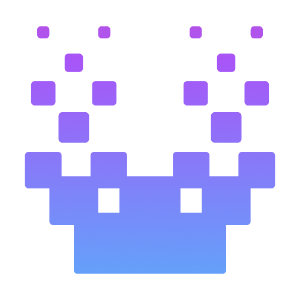

  

# UnodeAi

### Delegate to an AI team. Keep the receipts.

**Every AI coding tool can tell you it finished. UnodeAi can show you what it did.**

A project manager agent breaks your goal into tasks and delegates them to specialists — each on the model you
choose, inside the permissions you set. What an agent *claims* is kept separate from what the framework
*observed*, everywhere, by construction: an agent saying “done” is never printed as evidence, and no model is
ever asked to grade another model’s work.

[Get started](#quick-start) · [User guide](USAGE.md) · [Security model](SECURITY.md) ·
[Changelog](CHANGELOG.md) · [Models and pricing](https://www.unodetech.xyz/pricing?lang=en)

<!-- Add the Mission Control screenshot here when a real product asset is available. -->

## Built for the work where “it says it’s done” is not enough

| If you… | UnodeAi gives you |
| --- | --- |
| **Bill for the work** — agency, consultancy, contractor | A run exported as one Markdown file the client can read without installing anything, listing every dispatch, decision, approval and scope grant — and what it left out. A portable JSON variant carries no request text, instructions, command lines or file contents; agents and approvers become document-local ordinals, private routes become bounded categories, and write-time hashes prove change equality without retaining source. It declares both what it withheld and what it kept. |
| **Answer to someone** — regulated, procurement-reviewed, or security-reviewed teams | Evidence that was recorded as the work happened, not reconstructed afterwards. Contract, privacy and GRC roles that are read-only by capability, and a sanctions/export-control skill whose correct output is a refusal routed to a named human. |
| **Run more than one agent** | A coordinator that reports `partial` or `blocked` with a reason per undelivered item instead of going quiet — and, if it ends saying nothing, a closeout UnodeAi writes itself from observed facts, claiming nothing about correctness. |
| **Refuse to hand your code to one vendor** | Per-agent routing across Claude, OpenAI-compatible endpoints and your own gateways. Keys live in the OS keychain. Nothing leaves the machine unasked — no telemetry, no control service, no request at activation. |

## Why now

Agents crossed the line where delegating real work to them started paying off. The bottleneck moved with
them: it is no longer writing the code, it is **reviewing** it — and today reviewing an agent means reading a
summary the agent wrote about its own work. That is the one document with a reason to be wrong.

Two more things changed at the same time. No single model is best at everything any more, so *which model
runs which role* became a decision worth making per agent rather than per vendor. And agent output started
leaving the building — into client deliverables, audits and procurement reviews — where a chat log is not an
artifact anyone can accept.

Evidence stopped being a nice-to-have the moment people began shipping work they did not personally watch
get done.

## Why us

**The evidence layer is the product, not a feature attached to one.** It is cheap to add a summary view to a
tool that already trusts its agents, and it does not survive contact with a run that went wrong. Here the
separation is structural: verdicts come from recorded writes and observed check results, a delegate's prose
cannot become a green verdict, and the rules are held in place by mutation tests that fail if a sensor stops
sensing.

**Our own claims are auditable too, which is the only reason to believe the rest.** `SECURITY.md` is
re-audited before every release and records what it got wrong — including a boundary the previous release
overstated, corrected in place rather than quietly rewritten. CI builds the shipped artifact, a human
publishes those exact bytes without rebuilding, and the SHA-256 is published so you can check what you
installed against what was reviewed.

**It runs where you already work.** VS Code, Cursor and compatible editors — the widest editor range of the
tools we surveyed — with your providers, your keys and your team.

## Quality is a mechanism, not a promise

UnodeAi separates what an agent says from what the framework actually observed.

| What happened | What UnodeAi can honestly say |
|---|---|
| A delegation returned without a framework-visible trace | **No evidence** |
| Read, search, or other tool activity was recorded, but no change was verified | **Tool activity recorded; delivery not checked** |
| Files changed, but no matching passing verification was observed | **Replied, not verified** |
| A recorded change has an observed passing verification result | **Verified** |
| The coordinator explicitly decided to rely on the result | **Coordinator accepted** |
| The coordinator rejected an earlier result | **Coordinator rejected — amended**, with the earlier verdict and reason still visible |
| A decision belongs with a person | **Human intervention required** |

A green framework verdict means a check actually ran and passed. It never means a model declared its own work
good. Likewise, coordinator acceptance is an agent coordinator's explicit decision — not customer,
enterprise, or human acceptance.

The latest mechanism closes a gap our own field run exposed: a coordinator rejected work after an earlier
verdict had already been shown, but the framework never captured that decision. The coordinator can now record
`accepted`, `rejected`, or `needs-human` after it actually decides. A rejection requires a reason,
forwards it to the delegate, and visibly amends the verdict in Chat, Messages, and the Team card. UnodeAi is
capturing a decision the coordinator already made; it is not adding an LLM judge.

## How work moves

1. **You state the outcome.** Use Solo for a focused task or give the Project Manager a substantial goal.
2. **The PM plans and delegates.** It assigns roles, declares task scope, tracks progress, and keeps parallel
   work from silently colliding.
3. **Specialists work inside your boundaries.** Rules guide them; configured tools, approvals, provider
   routes, and folder access define their actual authority.
4. **Optional isolation keeps parallel changes reviewable.** When you enable worktree mode, delegated work
   can run in isolated lanes. UnodeAi does not infer or enable worktree mode from task wording.
5. **Your real check can gate integration.** When worktree mode is enabled and a verify command is configured
   and approved, its observed result can gate the merge. Without those conditions, UnodeAi does not claim an
   automatic quality gate.
6. **You review the integration.** `autoMerge` is off by default. The integration branch and its evidence
   remain available for review before work lands.
7. **You get the record.** See what changed, which tools ran, what passed, what was not checked, and whether a
   later coordinator decision amended an earlier verdict.

## Your process, as files you can inspect

The working agreement belongs with the project:

| What you define | Where it lives | What it does |
|---|---|---|
| **Repository guidance** | `AGENTS.md`, `CLAUDE.md`, `.unode/rules.md` | Records conventions, constraints, review expectations, and project-specific instructions |
| **Team** | `.unode/team.json` | Defines members, roles, model routes, tool capabilities, folder access, MCP grants, and team behavior |
| **Workflows** | The team definition | Encodes repeatable role-to-role work instead of rebuilding the sequence in every chat |

Repository guidance has a documented, inspectable precedence: `AGENTS.md`, then `CLAUDE.md`, then
`.unode/rules.md`. That does not make one file magically impossible to override; it makes the order visible,
reviewable, and changeable through the files you control.

Project knowledge is progressively disclosed. Each turn receives compact, deterministic indexes for the
instruction files and structured Markdown under `docs/`; an agent can load a relevant full source through
the existing root-confined read tool. This reduces standing context without pretending that every task becomes
cheaper — an agent may spend additional turns or tool calls fetching what it needs.

Rules can direct behavior, but they cannot grant authority. Project files do not widen Workspace Trust,
command approval, network consent, MCP grants, write policy, or folder access. Those boundaries remain
host-enforced and separately inspectable.

## Why teams choose UnodeAi

| Advantage | What it means in practice |
|---|---|
| **An AI team that follows your process** | Roles inherit your project rules, handoffs, workflows, and checks instead of requiring your team to adopt a proprietary ritual |
| **Evidence that names its limits** | Status comes from framework-visible actions and checks; later coordinator decisions amend the record rather than rewriting history |
| **Control at the task level** | A delegation can narrow a teammate's folder access for one assignment without permanently changing the agent |
| **A model per role** | Use premium reasoning where it matters, economical models for routine work, and different providers in the same crew |
| **Optional isolated delivery** | User-enabled worktrees separate parallel changes; configured and approved checks can gate integration |
| **Inspectable context and cost** | The context manifest lists sources and estimated text tokens; actual cost appears only where provider usage data supports it |
| **Security controls in the product** | Workspace Trust, per-host egress consent, command/write approval, MCP grants, folder scopes, and credential state are visible controls |

Model choice matters, but it is not the durable moat. Providers change, prices fall, and stronger models
arrive. What lasts is the process, evidence, and authority boundary your team can keep while swapping the
model underneath.

## Built with the team it ships

UnodeAi is built and audited with UnodeAi. Each release asks the shipped product to investigate the prior
release, then turns field evidence into the next mechanical guard.

That practice has changed the product in concrete ways:

- A field run found a read-only result described too generously; the verdict was narrowed to **Tool activity
  recorded; delivery not checked**.
- Another coordinator decision arrived after the displayed verdict; v0.9.47 makes the later rejection visible
  and preserves why it changed.
- Export truncation, temporary task scope, and overlapping delegation are now surfaced because our own audits
  found where a technically correct mechanism was still invisible at the decision point.

This is not a claim that the product validates itself. It is a receipt for how defects are found. Unit tests,
mutation gates, deterministic harness tasks, field runs, and human review each answer different questions;
none is promoted into evidence it did not collect.

## Security without surrendering usefulness

- **No telemetry.** UnodeAi does not run an analytics or remotely reachable control service.
- **Destinations are explicit.** Model data goes to providers you configure; network-capable tools use
  destinations you configured or explicitly approved. UnodeAi does not make an absolute claim that workspace
  data never leaves the machine while you are using a model or approved tool.
- **Workspace Trust is honored.** Execution surfaces stay off in an untrusted workspace.
- **Effects are gated.** Command and write behavior follows the policy you set; MCP servers are default-deny
  per agent until granted.
- **File tools are rooted.** Real-path checks prevent traversal and symlink escapes; task scope can narrow
  access but cannot widen the agent's permanent grant.
- **Secrets use VS Code SecretStorage.** Keys do not belong in team definitions, settings, exports, logs, or
  source control.
- **Human control remains human.** `needs-human` records that a decision is required; coordinator acceptance
  is never presented as enterprise sign-off.

See [SECURITY.md](SECURITY.md) for the complete network, execution, storage, Workspace Trust, and packaging
model.

## Quick start

1. Install UnodeAi and open a trusted workspace.
2. Choose a provider: use the Unode gateway, connect an OpenAI-compatible endpoint, use a local gateway, or
   run Claude through your existing Claude CLI login.
3. Create or import a team, then choose which model, capabilities, folder access, and MCP grants belong to
   each role.
4. Keep the project guidance you already use in `AGENTS.md` or `CLAUDE.md`, and add
   `.unode/rules.md` when you want UnodeAi-specific team guidance.
5. Optionally enable worktree mode. If you want verified merge gating, configure and approve the verify
   command and keep `autoMerge` off until you deliberately choose otherwise.
6. Give Solo a focused task or give the PM a larger outcome. Review the transcript, evidence, changes, and
   integration branch before finalizing.

The [User guide](USAGE.md) covers provider setup, teams, approvals, worktrees, workflows, MCP, exports, and
troubleshooting.

## A growing ecosystem, with bring-your-own paths

The catalog keeps growing across models, roles, skills, and MCP integrations. Growth is not limited to what
ships in one release:

- Start from built-in software, product, research, writing, operations, marketing, sales, finance, and
  governance roles, then edit them or define your own.
- Attach skill playbooks that are progressively disclosed when relevant instead of placing every procedure in
  every prompt.
- Connect supported MCP integrations per agent, with explicit grants.
- Bring your own OpenAI-compatible endpoint, gateway, model, API key, role instructions, workflows, and MCP
  servers; choose from the growing set of validated skill playbooks.

The point of the ecosystem is choice under one governance model. A larger catalog should not become a reason
to hide what an agent can access or where data can go.

## Providers and capabilities

Use the Unode gateway for one account across many models, connect another OpenAI-compatible provider, route to
a local or self-hosted model, or use Claude through your own Claude CLI login. Codex Headless remains visible
as Coming soon while its mediated runner is completed.

Roles can use different providers in the same crew. The surrounding process — context, permissions, approvals,
task scope, evidence, and verification — remains inspectable when you change the model.

Core capabilities include:

- PM-led delegation with async fan-out, progress, result collection, and file-scope conflict detection
- Custom agents, reusable role templates, progressively disclosed skills, and deterministic workflows
- Explicit task-scoped folder access that can narrow but never widen a delegate's permanent grant
- User-enabled git worktrees, reviewable integration branches, and optional verify-command merge gating
- `autoMerge` off by default
- Coordinator `accepted`, `rejected`, and `needs-human` decisions with visible amended verdicts
- Chat, Team, and Messages evidence surfaces, plus exports that disclose retained-window truncation
- Per-turn context manifests with source provenance and estimated text-token counts
- Actual usage and cost only when the selected provider reports enough usage data to support them
- Command and write approvals, rooted file tools, Workspace Trust, per-host egress consent, and default-deny
  MCP grants
- Custom and bring-your-own options across providers, models, roles, workflows, and integrations, alongside a
  growing catalog of validated skill playbooks

## New in v0.9.76

**A refusal now explains a safe next step, and task-only tools appear only where they can work.**

- **The permission boundary did not relax.** The set of refused paths, commands, tools, and destinations is
  identical. A refusal may append a reviewed, host-authored explanation of how to proceed safely; it never
  forwards a path, credential, command, destination, or your free-form reason for denying a web request.
- **Task-only artifact and context-gap tools are advertised only during a live contracted attempt** on
  OpenAI-compatible connections. A stale direct request still reaches its host handler and receives the
  accurate refusal; Claude's fixed-at-connection tool schema remains unchanged.
- **Three previously unpinned authority boundaries now have tests.** This does not alter the product surface;
  `npm run test:release-authority-canaries` proves all twelve named authority mutations are killed.
- **Dashboard status colours now use VS Code theme tokens.** Working and done have distinct semantic tokens,
  and tokens that may be unavailable keep the earlier colour as a fallback so an indicator does not become
  colourless. This release does not make a visual-verification claim for any theme.
- **Burst streaming now remains steady as text arrives.** The growing paragraph preserves its DOM node across
  paced paints, so a text selection inside it is not recreated on the next frame.

## Previously in v0.9.75

**A delegate refused for scope keeps working; only a real workspace escape ends its turn.**

- **The boundary did not relax.** The same actions remain refused and no new path becomes readable or
  writable. A real attempt to leave the configured workspace is still blocked and terminal; the terminal
  decision now comes from a typed path-boundary result instead of matching words in a host message.
- **A shell line that only *looks* out of root is still blocked and never runs, but does not strand the
  turn.** That detector scans command text, so it is a safety heuristic rather than a filesystem proof; the
  agent can make its next safe call instead.
- **An expired, unsupported, or unforwarded temporary asset stays unavailable without ending useful work.**
  It remains a refusal, not permission to retrieve, reuse, or send the asset.
- **A coordinator can attach a short, sourced brief to one delegated assignment.** The worker receives it as
  a coordinator claim, not host evidence. If it would travel to a different model destination, UnodeAi opens
  a per-dispatch modal naming that destination: the brief may paraphrase your documents and travels in the
  worker prompt, not through a read tool. Declining refuses that dispatch; same-destination work asks nothing
  new.
- **A delegated task that needs no supplied material is no longer told not to use the web.** The task card's
  input-substitution rule now follows the contract: unchanged when a required input is declared, and absent
  when none is — where it had nothing to apply to and read as a flat prohibition. The card itself neither
  grants nor removes web access; that stays the agent's configured capability.

## Previously in v0.9.74

**A task-scope refusal tells an agent what it can do next, without widening the task.**

- **A request inside an agent's configured folders but outside its temporary assignment no longer ends the
  turn.** The refusal identifies the narrower task boundary, the agent can use a granted input or report the
  gap, and the next safe tool call continues in the same turn. A true attempt to leave the configured folders
  remains terminal and still asks for the correct project to be opened.
- **The physical path follows the same rule.** A symlink that resolves into configured access but outside the
  assignment is recoverable; one that resolves outside configured access remains blocked. The tests prove both
  directions, so removing either boundary classification fails the release gate.
- **An unavailable image asset is a capability limit, not a folder error.** Its omission no longer tells an
  agent to open another project or terminates an otherwise useful turn.
- **Run-record field policy is declared where the fields are named.** Every required field now has an explicit
  portable or non-portable policy, derived summaries declare their source fields, and stored JSON stays
  `unknown` until the normalizer checks it. New fields cannot silently escape portable-schema review.
- **Directory activity says what happened.** Directory operations are shown as **List** / **Listed N folders**,
  rather than being presented as file reads.

## License

See [LICENSE](LICENSE).
