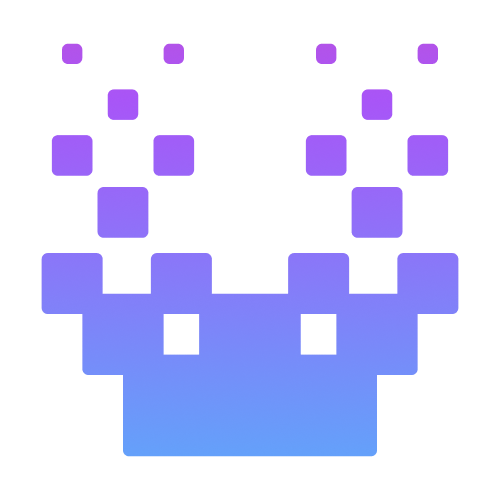

  

# UnodeAi

### Turn AI agents into an organized workforce.

**Every AI coding tool can tell you it finished. UnodeAi can show you what it did.**

A project manager agent breaks your goal into tasks and hands them to specialists. Each one has a role, its
own skills, the model you picked for it, and only the permissions you granted. What an agent *claims* stays
separate from what the framework *observed*. An agent saying “done” is never printed as evidence, and no model
is ever asked to grade another model’s work.

[Get started](#quick-start) · [User guide](USAGE.md) · [Security model](SECURITY.md) ·
[Changelog](CHANGELOG.md) · [Models and pricing](https://www.unodetech.xyz/pricing?lang=en)

<!-- Add the Mission Control screenshot here when a real product asset is available. -->

## Built for the work where “it says it’s done” is not enough

| If you… | UnodeAi gives you |
| --- | --- |
| **Bill for the work** — agency, consultancy, contractor | A run exported as one Markdown file the client can read without installing anything, listing every dispatch, decision, approval and scope grant — and what it left out. A portable JSON variant carries no request text, instructions, command lines or file contents; agents and approvers become document-local ordinals, private routes become bounded categories, and write-time hashes prove change equality without retaining source. It declares both what it withheld and what it kept. |
| **Answer to someone** — regulated, procurement-reviewed, or security-reviewed teams | Evidence that was recorded as the work happened, not reconstructed afterwards. Contract, privacy and GRC roles that are read-only by capability, and a sanctions/export-control skill whose correct output is a refusal routed to a named human. |
| **Run more than one agent** | A coordinator that reports `partial` or `blocked` with a reason per undelivered item instead of going quiet — and, if it ends saying nothing, a closeout UnodeAi writes itself from observed facts, claiming nothing about correctness. |
| **Refuse to hand your code to one vendor** | Per-agent routing across Claude, OpenAI Codex, OpenAI-compatible endpoints and your own gateways. Keys live in the OS keychain. Nothing leaves the machine unasked — no telemetry, no control service, no request at activation. |

## Vibe coding, with an operating model

AI coding is no longer limited to traditional software teams. Application engineers, technical salespeople,
and business leads can now build internal tools and respond to customers without waiting for a central backlog.
That speed is valuable. The risk is that every project invents its own structure: different agents, different
permissions, missing reviews, undocumented deployment steps, and no reliable record of what actually happened.

UnodeAi lets a company keep the speed while putting the engineering system back around the work. Claude,
Codex, and compatible models can operate as one inspectable team; project-owned roles, rules, workflows,
approvals, checks, and deployment expectations travel with the repository instead of living in one person's
chat history. The permission layer controls what each role may do, and the evidence layer records what changed,
what was checked, and what still needs a person.

The goal is not to turn every builder into a traditional software engineer. It is to let more people build
without making the resulting software unmanageable.

## Companies already solved this. We’re teaching it to agents.

A company is not just a group of capable people. It’s a set of agreements: who owns what, who decides, who
reviews, and what gets written down. Those agreements are why a hundred people’s work adds up instead of
colliding.

Nobody designed them in a room. They were worked out over a century of getting it wrong, and they remain the
most tested coordination technology we have.

Agents skipped all of it.

The last three years went into making a single agent more capable. Almost none of it went into how several
agents work together. So a team of agents ends up looking like a company with no job titles, no manager, no
sign-off, and no filing cabinet. Everyone is competent. Nothing is accountable.

If you have given an AI real work, you already know how this feels. It sounds just as confident when it fails
as when it succeeds. Nobody reviews it but you. And when it’s finished, you have a chat log where a record
should be.

A better model doesn’t fix that. Ask a stronger one the same way and it fails the same way, because what was
missing was never intelligence.

**UnodeAi supplies the structure.** Each agent has a role and a mandate. A project manager agent assigns the
work and collects the results. Permissions decide what each one can reach. Finishing means something specific:
a check that ran, or a person who signed off. And the record keeps what an agent claimed apart from what
actually happened, because “I’m done” has never counted as proof in a company either.

This stopped being optional when agent output started leaving the building — into client deliverables, audits
and procurement reviews, where a chat log is not an artifact anyone can accept.

We’ll say what we’re betting on. This structure is proven for people. Whether it works as well for agents is
the question this product exists to answer, and the evidence layer is there so you can judge for yourself.

## What the organization is made of

UnodeAi ships **52 role templates** and **25 team presets** — Software Engineering, Marketing, Sales, Contract
& Compliance, Security & Governance, Business Operations, Revenue Operations, Customer Experience, Data
Intelligence, Product Discovery, and more — so a team is something you assemble, not something you rebuild in
every conversation.

| | The company equivalent |
|---|---|
| **Role** | a job title with a mandate |
| **Skills** | the procedures that job runs on, loaded when they are relevant |
| **Manager** | a project manager agent that assigns work and collects results |
| **Workflow** | a repeatable handoff between roles |
| **Authority** | what this position may reach, and what needs approval first |
| **Evidence** | the file that outlives the conversation |

No single model is best at everything any more, so *which model runs which role* is a decision worth making
per agent rather than per vendor.

## Why us

**The evidence layer is the product, not a feature attached to one.** It is cheap to add a summary view to a
tool that already trusts its agents, and it does not survive contact with a run that went wrong. Here the
separation is structural: verdicts come from recorded writes and observed check results, a delegate's prose
cannot become a green verdict, and the rules are held in place by mutation tests that fail if a sensor stops
sensing.

**Our own claims are auditable too, which is the only reason to believe the rest.** `SECURITY.md` is
re-audited before every release and records what it got wrong — including a boundary the previous release
overstated, corrected in place rather than quietly rewritten. CI builds the shipped artifact, a human
publishes those exact bytes without rebuilding, and the SHA-256 is published so you can check what you
installed against what was reviewed.

**It runs where you already work.** VS Code, Cursor and Devin — with your providers, your keys and your
team.

## Quality is a mechanism, not a promise

UnodeAi separates what an agent says from what the framework actually observed.

| What happened | What UnodeAi can honestly say |
|---|---|
| A delegation returned without a framework-visible trace | **No evidence** |
| Read, search, or other tool activity was recorded, but no change was verified | **Tool activity recorded; delivery not checked** |
| Files changed, but no matching passing verification was observed | **Replied, not verified** |
| A recorded change has an observed passing verification result | **Verified** |
| The coordinator explicitly decided to rely on the result | **Coordinator accepted** |
| The coordinator rejected an earlier result | **Coordinator rejected — amended**, with the earlier verdict and reason still visible |
| A decision belongs with a person | **Human intervention required** |

A green framework verdict means a check actually ran and passed. It never means a model declared its own work
good. Likewise, coordinator acceptance is an agent coordinator's explicit decision — not customer,
enterprise, or human acceptance.

The latest mechanism closes a gap our own field run exposed: a coordinator rejected work after an earlier
verdict had already been shown, but the framework never captured that decision. The coordinator can now record
`accepted`, `rejected`, or `needs-human` after it actually decides. A rejection requires a reason,
forwards it to the delegate, and visibly amends the verdict in Chat, Messages, and the Team card. UnodeAi is
capturing a decision the coordinator already made; it is not adding an LLM judge.

## How work moves

1. **You state the outcome.** Use Solo for a focused task or give the Project Manager a substantial goal.
2. **The PM plans and delegates.** It assigns roles, declares task scope, tracks progress, and keeps parallel
   work from silently colliding.
3. **Specialists work inside your boundaries.** Rules guide them; configured tools, approvals, provider
   routes, and folder access define their actual authority.
4. **Optional isolation keeps parallel changes reviewable.** When you enable worktree mode, delegated work
   can run in isolated lanes. UnodeAi does not infer or enable worktree mode from task wording.
5. **Your real check can gate integration.** When worktree mode is enabled and a verify command is configured
   and approved, its observed result can gate the merge. Without those conditions, UnodeAi does not claim an
   automatic quality gate.
6. **You review the integration.** `autoMerge` is off by default. The integration branch and its evidence
   remain available for review before work lands.
7. **You get the record.** See what changed, which tools ran, what passed, what was not checked, and whether a
   later coordinator decision amended an earlier verdict.

## Your process, as files you can inspect

The working agreement belongs with the project:

| What you define | Where it lives | What it does |
|---|---|---|
| **Repository guidance** | `AGENTS.md`, `CLAUDE.md`, `.unode/rules.md` | Records conventions, constraints, review expectations, and project-specific instructions |
| **Team** | `.unode/team.json` | Defines members, roles, registered model routes, instructions, workflows, and restrictions that can only narrow host authority |
| **Workflows** | The team definition | Encodes repeatable role-to-role work instead of rebuilding the sequence in every chat |

Repository guidance has a documented, inspectable precedence: `AGENTS.md`, then `CLAUDE.md`, then
`.unode/rules.md`. That does not make one file magically impossible to override; it makes the order visible,
reviewable, and changeable through the files you control.

Project knowledge is progressively disclosed. Each turn receives compact, deterministic indexes for the
instruction files and structured Markdown under `docs/`; an agent can load a relevant full source through
the existing root-confined read tool. This reduces standing context without pretending that every task becomes
cheaper — an agent may spend additional turns or tool calls fetching what it needs.

Rules can direct behavior, but they cannot grant authority. Project files do not widen Workspace Trust,
command approval, network consent, MCP grants, write policy, or folder access. Those boundaries remain
host-enforced and separately inspectable.

## Why teams choose UnodeAi

| Advantage | What it means in practice |
|---|---|
| **An AI team that follows your process** | Roles inherit your project rules, handoffs, workflows, and checks instead of requiring your team to adopt a proprietary ritual |
| **Evidence that names its limits** | Status comes from framework-visible actions and checks; later coordinator decisions amend the record rather than rewriting history |
| **Control at the task level** | A delegation can narrow a teammate's folder access for one assignment without permanently changing the agent |
| **A model per role** | Use premium reasoning where it matters, economical models for routine work, and different providers in the same crew |
| **Optional isolated delivery** | User-enabled worktrees separate parallel changes; configured and approved checks can gate integration |
| **Inspectable context and cost** | The context manifest lists sources and estimated text tokens; actual cost appears only where provider usage data supports it |
| **Security controls in the product** | Workspace Trust, per-host egress consent, command/write approval, MCP grants, folder scopes, and credential state are visible controls |

Model choice matters, but it is not the durable moat. Providers change, prices fall, and stronger models
arrive. What lasts is the process, evidence, and authority boundary your team can keep while swapping the
model underneath.

## Built with the team it ships

UnodeAi is built and audited with UnodeAi. Each release asks the shipped product to investigate the prior
release, then turns field evidence into the next mechanical guard.

That practice has changed the product in concrete ways:

- A field run found a read-only result described too generously; the verdict was narrowed to **Tool activity
  recorded; delivery not checked**.
- Another coordinator decision arrived after the displayed verdict; v0.9.47 makes the later rejection visible
  and preserves why it changed.
- Export truncation, temporary task scope, and overlapping delegation are now surfaced because our own audits
  found where a technically correct mechanism was still invisible at the decision point.

This is not a claim that the product validates itself. It is a receipt for how defects are found. Unit tests,
mutation gates, deterministic harness tasks, field runs, and human review each answer different questions;
none is promoted into evidence it did not collect.

## Security without surrendering usefulness

- **No telemetry.** UnodeAi does not run an analytics or remotely reachable control service.
- **Destinations are explicit.** Model data goes to providers you configure; network-capable tools use
  destinations you configured or explicitly approved. UnodeAi does not make an absolute claim that workspace
  data never leaves the machine while you are using a model or approved tool.
- **Workspace Trust is honored.** Execution surfaces stay off in an untrusted workspace.
- **Effects are gated.** Command and write behavior follows the policy you set; UnodeAi-managed MCP integrations
  are default-deny per agent until granted. MCP servers you configure directly in Claude or Codex stay under that
  CLI's own controls.
- **File tools are rooted.** Real-path checks prevent traversal and symlink escapes; task scope can narrow
  access but cannot widen the agent's permanent grant.
- **Secrets use VS Code SecretStorage.** Keys do not belong in team definitions, settings, exports, logs, or
  source control.
- **Human control remains human.** `needs-human` records that a decision is required; coordinator acceptance
  is never presented as enterprise sign-off.

See [SECURITY.md](SECURITY.md) for the complete network, execution, storage, Workspace Trust, and packaging
model.

## Quick start

1. Install UnodeAi and open a trusted workspace.
2. Choose a provider: use the Unode gateway, connect an OpenAI-compatible endpoint, use a local gateway, or
   run Claude or Codex through your existing CLI login.
3. Create or import a team, then choose which model, capabilities, folder access, and MCP grants belong to
   each role.
4. Keep the project guidance you already use in `AGENTS.md` or `CLAUDE.md`, and add
   `.unode/rules.md` when you want UnodeAi-specific team guidance.
5. Optionally enable worktree mode. If you want verified merge gating, configure and approve the verify
   command and keep `autoMerge` off until you deliberately choose otherwise.
6. Give Solo a focused task or give the PM a larger outcome. Review the transcript, evidence, changes, and
   integration branch before finalizing.

The [User guide](USAGE.md) covers provider setup, teams, approvals, worktrees, workflows, MCP, exports, and
troubleshooting.

## A growing ecosystem, with bring-your-own paths

The catalog keeps growing across models, roles, skills, and MCP integrations. Growth is not limited to what
ships in one release:

- Start from built-in software, product, research, writing, operations, marketing, sales, finance, and
  governance roles, then edit them or define your own.
- Attach skill playbooks that are progressively disclosed when relevant instead of placing every procedure in
  every prompt.
- Connect supported MCP integrations per agent, with explicit grants.
- Bring your own OpenAI-compatible endpoint, gateway, model, API key, role instructions, workflows, and MCP
  servers; choose from the growing set of validated skill playbooks.

The point of the ecosystem is choice under one governance model. A larger catalog should not become a reason
to hide what an agent can access or where data can go.

## Providers and capabilities

Use the Unode gateway for one account across many models, connect another OpenAI-compatible provider, route to
a local or self-hosted model, or use Claude or Codex through your own CLI login. Claude and Codex agents can both
lead a team and use UnodeAi playbooks and granted integrations, each under its own permission model.

Codex CLI asks before its App Server starts, and each Codex agent runs under a Codex permission profile you
choose: **Ask for approval** (the default), **Approve for me** (Codex's reviewer decides; UnodeAi shows its review
trail through Codex's `auto-review` mode), or **Full access (unsafe)** — no sandbox, network on, no prompts, always
confirmed first and flagged with a persistent warning. Ask for approval uses Codex's `workspace-write` sandbox with
`on-request` approvals. Routine Codex edits do not create UnodeAi checkpoints. Under Ask for approval, routine commands and edits inside the workspace
sandbox run without a card. Plan mode and host trust, folder and tool ceilings resolve to **Read only**. Codex connects
to OpenAI and to the model provider configured in your Codex; UnodeAi does not control those destinations or claim
that Codex reads are confined to the workspace. Repository CLI configuration loads only after a content-bound
confirmation. The [User guide](USAGE.md) has the full details.

Roles can use different providers in the same crew. The surrounding process — context, permissions, approvals,
task scope, evidence, and verification — remains inspectable when you change the model.

Core capabilities include:

- PM-led delegation with async fan-out, progress, result collection, and file-scope conflict detection
- Long tasks that hit a safety stop return a clear partial answer that the coordinator can continue
- Custom agents, reusable role templates, progressively disclosed skills, and deterministic workflows
- Explicit task-scoped folder access that can narrow but never widen a delegate's permanent grant
- User-enabled git worktrees, reviewable integration branches, and optional verify-command merge gating
- `autoMerge` off by default
- Coordinator `accepted`, `rejected`, and `needs-human` decisions with visible amended verdicts
- Chat, Team, and Messages evidence surfaces, plus exports that disclose retained-window truncation
- Per-turn context manifests with source provenance and estimated text-token counts
- Actual usage and cost only when the selected provider reports enough usage data to support them, each cost
  labelled by its source, with optional spend reminders that never stop work
- Provider-accurate command/write controls (UnodeAi gates for hosted tools and Claude; Codex's native permission
  profile), rooted file tools, Workspace Trust, per-host egress consent, and default-deny managed MCP grants
- **Your integrations**: each integration's connection and granted agents in one place, with remove-and-revoke
- Custom and bring-your-own options across providers, models, roles, workflows, and integrations, alongside a
  growing catalog of validated skill playbooks

## New in v0.9.93

**When a team job finishes, see what happened, from what UnodeAi recorded and not from what the agents said.**

- **A Job outcome card closes every team job.** After the coordinator's final reply, Chat shows one card: how the
  job closed, what the declared checks showed, how many files changed, what it cost and how long it took. Open it
  for eight sections, from the work and the changes to the approvals and the timing. It appears in the sidebar
  and in the Workbench, once, and it is in the same place after a reload.
- **Nothing on it is an agent's word.** Every figure is something UnodeAi itself recorded while the job ran.
  `Verified` appears only when a check declared for the task was seen to pass. A reply that says "all tests pass"
  changes nothing on the card.
- **It says what it does not know.** A missing price is `cost unavailable`, never `$0`. Amounts on different
  bases are listed side by side and not added up. A change list that is not whole says so.
- **Stop a task and the job ends there.** When you stop the last running task of a job while its coordinator
  is idle, the card appears at once under the coordinator's last reply, as `Partial`, with the stopped task
  listed. A job with a stopped or interrupted task is never shown as `Complete`.
- **Continue unfinished work is a new request, and you see it first.** The card lists what remains. One button
  composes a new request from the recorded facts and shows it to you before anything is sent. Nothing is resumed
  or retried by itself.
- **The evidence report is the same facts.** **Open evidence** on the card, or **Generate Evidence Report**,
  writes the job's outcome as a Markdown document. It runs no check again. The card shows times in your local
  time with the time zone; every exported document says that its times are UTC.
- **A coordinator that does nothing is stopped for you to decide.** If a coordinator reaches no dispatch, close
  or reply while its model sends nothing for 60 seconds, the request ends with a card and its choices: retry on
  the same route, switch route, or stop. Nothing is retried or switched for you.
- **A dispatch to nobody is refused.** A coordinator gets the team's candidates with each request. A task
  addressed to a name that matches no teammate is refused with the current names, and the coordinator can look
  again and retry. Before, the coordinator ended up doing such a task itself.
- **A retried task counts once.** When UnodeAi retries a task whose reply was empty, both attempts are recorded
  as one task. Portable Run Evidence carries the link and is now `portable-run-evidence/5`.
- **The Team panel shows a member at a glance.** An expanded row has Provider, Role, Status and Reasoning in one
  strip.

## Previously in v0.9.92

**See where each turn's time went, and let an agent wait without paying for every look.**

- **The live line says what is happening.** While an agent works, the line at the end of the chat reads
  `Waiting for Claude`, `Reasoning`, `Responding`, `Running npm test` or `Waiting for your approval`, with its
  own timer and the turn time beside it. `Reasoning` appears only when the provider sends reasoning; silence
  after a request is no longer shown as thinking.
- **Every finished turn shows where its time went.** A second footer line, such as
  `Observed: waiting for provider 15s · reasoning 2s · responding 2s · tools 1s · host 1s`, adds up to the turn
  time exactly. A turn from an earlier version shows no breakdown instead of zeroes.
- **Your decisions are not the agent's time.** Every approval and every consent dialog pauses the turn clock,
  also for a request that is still queued. When several agents wait on one dialog, each is charged only its
  own wait. A tool card says **Waiting for your approval** while you decide, and its finished duration leaves
  your time out and names it.
- **A team agent can run Vitest on Windows.** A command UnodeAi started for an agent inherited the workspace
  path with a lower-case drive letter, and Vitest 4.1 fails from such a folder before any test runs. Commands
  and agent terminals now start in the folder as a terminal spells it. This covers agents on OpenAI-compatible
  and custom-gateway routes; agents on the Claude CLI and Codex CLI routes run commands inside their own CLI
  and are not changed.
- **An agent can wait for a long command in one step.** It waits up to five minutes for a background command
  instead of asking again and again, where each question re-sent its whole context to the model, and it can
  give a foreground command up to ten minutes. **Stop** ends a wait at once.
- **Less paperwork before a hand-off.** The coordinator is now told which fields of a task contract are
  normally left empty, so filling it in is no reason to read the code first.
- **The Workbench shows the context meter in its header bar.** It sits at the right end, beside the **…** menu, and
  the header no longer repeats the context size. The Chat sidebar keeps the meter beside **⤓** Compact.
- **The System Architect can verify technical work.** New/reset Architect roles can run commands through the same
  Workspace Trust, scope, command-policy and approval boundaries as developers. Existing saved agents are not
  silently widened: review and save the role in Agent Builder to adopt the new capability, and the form names
  what the save adds. An agent that still
  lacks Run commands is told to report that immediately instead of searching files or history as a substitute.
- **A built-in role can do the work it describes.** Sixteen more roles can run commands: those that have to
  verify what they deliver, such as the Reviewer, the Security Engineer and the Technical Writer, and those that
  have to calculate, such as the Data Analyst and the Financial Analyst. Every command still needs your
  approval. The Reviewer and the other assessment roles can write their review or report to a file. Sales and customer-success roles now say plainly that they draft for a person to send.
- **Analysis no longer expands into screens of blank space.** Whitespace-only reasoning is not rendered, and long
  blank-line runs from a reasoning provider are collapsed while its actual words and timing remain visible.

## Previously in v0.9.91

**Every tool result says what actually happened, and each Claude agent keeps its own safety gate.**

- **A refusal stays a refusal.** When you decline an approval, or Workspace Trust, folder scope, policy or a hook
  blocks a tool, the card records that decision and its reason on every runtime: OpenAI-compatible routes, Claude
  CLI and Codex CLI. Claude and Codex cards used to be labelled by guessing from the wording of the result. Nothing
  is guessed from wording any more.
- **Each result lands on its own card.** Every tool call has its own id, so when the same tool runs several times
  at once, a result can no longer finish the wrong card.
- **A coordinator is told how a delegated task really ended.** A task that failed, timed out, was cancelled or was
  refused by team policy now reaches the coordinator as exactly that. Before, a blocking assignment always counted
  as a successful call, and a reply that merely began with the word "Error" was flagged as failed. A timeout is
  reported as an unknown outcome, because the teammate may still finish.
- **Security fix for teams with two or more Claude CLI agents.** Since v0.9.28, Claude agents sharing a working
  folder wrote their tool-gate file to one shared path. The agent started last decided the others' tool approvals,
  and after it stopped, the others' tools ran without that check. Each agent now writes its own files. If you run
  more than one Claude CLI agent in a folder, update.
- **One record per finished turn.** Each turn now stores a small record with no content in it: how the reply ended,
  and how many tool calls succeeded, were refused or failed. Nothing displays it yet. Chats and runs from
  earlier versions count as not recorded, never as "no tools used".

## License

See [LICENSE](LICENSE).
